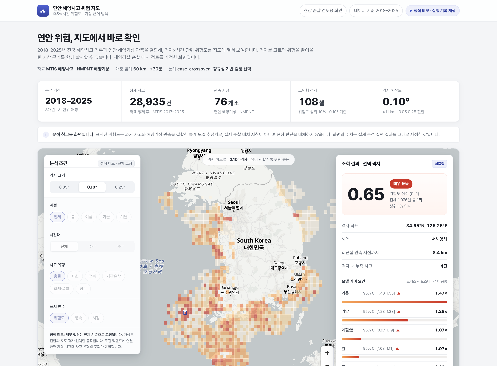
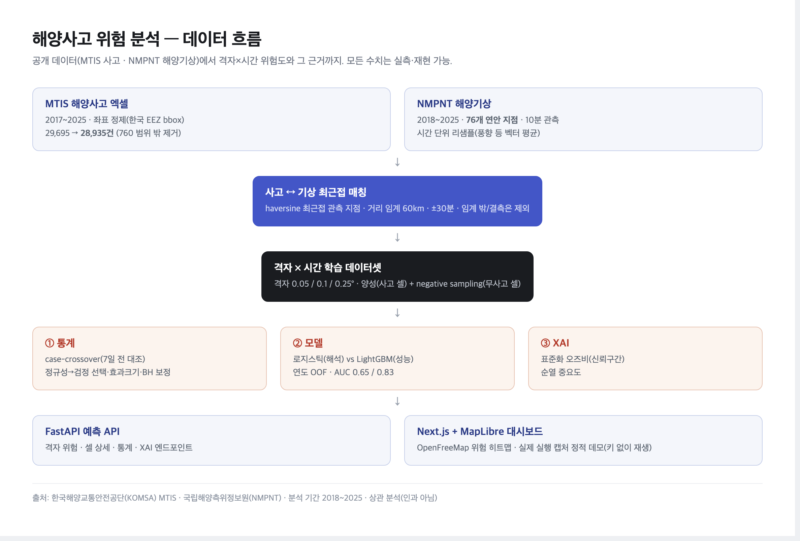

# korean-marine-accident-risk

[](https://korean-marine-accident-risk.vercel.app)


전국 연안의 해양사고 기록과 해양기상 관측을 결합해 **격자×시간 단위 사고 위험도**를 추정하고, 어떤 기상·환경 조건이 위험을 끌어올리는지 통계와 해석 모델로 설명하는 분석 프로젝트다. 결과는 해양경찰 순찰 배치 검토를 가정한 지도 대시보드로 보여준다.

해양사고는 드물고 위치·시각이 불규칙해, 단순 건수 집계만으로는 "언제 어디가 위험한지" 말하기 어렵다. 게다가 기상 관측은 연안 76개 지점에만 있고 사고는 그 사이 바다에서 난다. 그래서 사고 좌표를 정제하고, 가장 가까운 관측 지점의 같은 시각 기상을 거리 임계 안에서 매칭한 뒤, 변수 분포가 정규인지 먼저 확인해 맞는 검정을 고르고, 해석 가능한 모델로 위험도를 추정했다.



> 위 화면은 실제 분석 실행 결과를 캡처한 정적 데모다(표시 수치는 손으로 고치지 않았다). **라이브: [korean-marine-accident-risk.vercel.app](https://korean-marine-accident-risk.vercel.app)** — 키 없이 동작한다.

## 구현 범위

코드와 테스트로 확인되는 기능이다. 모든 수치는 아래 재현 명령으로 다시 만들 수 있다.

- **MTIS 사고 데이터 적재·좌표 정제** — 엑셀(시트 `사고목록`)을 분석용 스키마로 적재하고, 한국 EEZ 대략 bbox 밖·결측 좌표를 제거한다(29,695 → 28,935건, 760건 범위 밖).
- **NMPNT 해양기상 수집** — 전국 76개 관측 지점 중 기상값이 있는 71개의 2018~2025 기상을 받아 10분값을 시간 단위로 리샘플한다(풍향 등 각도는 벡터 평균). 수집은 중단돼도 이어받고, 실패한 날짜만 건너뛴다.
- **격자 배정·사고-기상 매칭·negative sampling** — 0.05·0.1·0.25° 세 해상도, haversine 최근접 지점(거리 임계 60km·±30분), 무사고 셀을 양성당 3배(기본) 추출.
- **통계 분석(case-crossover)** — 사고 시점 기상과 사고 전 7일 동시간 대조를 짝지어, 정규성에 따라 검정을 자동 선택하고 효과크기·Benjamini–Hochberg(FDR) 보정을 함께 낸다.
- **모델** — 해석 모델 로지스틱 회귀와 성능 상한 비교용 LightGBM을 연도 기준 OOF 교차검증으로 평가(AUC·PR-AUC·Brier·임계값 표).
- **XAI** — 표준화 오즈비(신뢰구간 포함)와 순열 중요도로 위험 요인을 설명한다.
- **FastAPI 예측 API** — 격자 위험·셀 상세·통계·XAI 엔드포인트.
- **Next.js + MapLibre 지도 대시보드** — 실제 실행을 캡처한 정적 데모(키 없이 재생).

## 아키텍처



```text
MTIS 사고 엑셀(2017~2025)              NMPNT 해양기상(2018~, 10분, 76지점)
   │ 좌표 정제·시간 정규화                  │ 지점 수집·시간 리샘플(풍향 벡터 평균)
   ▼                                        ▼
사고 포인트 ─── 최근접 지점 거리 임계(60km·±30분) 매칭 ───► 사고×기상 결합
   │                                                        │
   │  격자(0.05/0.1/0.25°) 배정 + negative sampling          │
   ▼                                                        ▼
        격자×시간 학습 데이터셋 ──► ① 통계(정규성→검정 선택→효과크기→BH·case-crossover)
                                    ② 모델(로지스틱·LightGBM, 연도 OOF)
                                    ③ XAI(오즈비·순열 중요도)
                                    ▼
                              FastAPI 예측 API
                                    ▼
                  Next.js + MapLibre 지도 대시보드(정적 데모)
```

## 기술 스택

| 영역 | 사용 기술 |
|---|---|
| 언어·패키지 | Python 3.12, uv |
| 데이터·수치 | pandas, numpy |
| 수집 | httpx, tenacity |
| 통계 | scipy, statsmodels |
| 모델 | scikit-learn, lightgbm |
| 서빙 | FastAPI, uvicorn |
| 프론트 | Next.js, React, TypeScript, MapLibre GL JS, OpenFreeMap |
| 품질 | pytest, ruff, mypy |

## 실행 방법

### 데이터 준비

사고 원본은 라이선스상 레포에 포함하지 않는다. 직접 내려받아 배치한다.

1. 한국해양교통안전공단(KOMSA) MTIS "GIS기반 해양사고분석"에서 사고 목록 엑셀을 내려받는다.
2. `data/raw/GIS기반해양사고분석.xlsx` 로 저장한다(`data/`는 `.gitignore` 대상).

### 분석 파이프라인

```bash
uv sync                                          # 의존성 설치(Python 3.12)
make clean-report                                # 좌표 정제 리포트
export NMPNT_SERVICE_KEY=...                      # 국립해양측위정보원 서비스키
uv run python scripts/collect_weather_bulk.py    # 전기간 기상 수집(재개 가능)
uv run python scripts/build_dataset.py           # 격자×시간 학습셋
uv run python scripts/run_stats.py               # case-crossover 통계
uv run python scripts/run_model.py               # 로지스틱·LightGBM 평가
uv run python scripts/run_xai.py                 # 오즈비·순열 중요도
```

### API와 프론트

```bash
uv run uvicorn marine_accident_risk.serving.app:get_app --factory   # 예측 API
cd web && npm install && npm run dev                                  # 대시보드(개발)
npm run build                                                         # 정적 export → web/out
```

## 평가 / 검증

표는 모두 `reports/` 산출물 한 곳에서 끌어온다.

### case-crossover (`reports/stats/case_crossover.md`)

사고 시점 기상이 평소와 유의하게 다른지를 짝지어 비교했다. 큰 표본이라 작은 차이도 유의해지므로 효과크기를 함께 본다.

| 변수 | 검정 | 효과크기 | q(BH) |
|---|---|---|---|
| 풍속 | Wilcoxon | **−0.073** | <0.01 |
| 습도 | Wilcoxon | −0.034 | <0.05 |
| 기압 | Wilcoxon | +0.030 | <0.05 |
| 기온 | Wilcoxon | +0.026 | <0.05 |

풍속·습도·기압·기온이 통계적으로 유의했지만 효과크기는 작고, **풍속은 오히려 사고 시점이 약간 낮았다**.

### 모델 (`reports/model/metrics.md`, 격자 0.1°)

| 모델 | AUC | PR-AUC | Brier |
|---|---|---|---|
| 로지스틱(해석) | 0.653 | 0.422 | 0.233 |
| LightGBM(성능 상한) | 0.834 | 0.698 | 0.159 |

### XAI 핵심 (`reports/xai/odds_ratios.md`)

야간일수록 사고 오즈가 낮고(0.62×), 기온·기압이 높을수록 오즈가 올라가며(1.47×·1.28×), 풍속은 유의하지 않았다. 즉 이 데이터에서 사고는 *위험한 기상*보다 **활동 패턴**(주간·따뜻한 날·특정 해역)에 더 좌우된다 — 사고의 상당수가 기관손상·부유물감김 같은 비기상 요인이라는 점과 일치한다.

## 프로젝트 구조

```text
src/marine_accident_risk/
  data/      # MTIS 로더·좌표 정제·NMPNT 수집기·기상 캐시
  grid/      # 격자 배정·negative sampling
  matching/  # 사고-기상 최근접 매칭(haversine)
  stats/     # 정규성·검정 선택·효과크기·BH·case-crossover
  modeling/  # 특징 구성·OOF 교차검증·지표·임계값
  serving/   # FastAPI 예측 API
web/         # Next.js + MapLibre 대시보드, 정적 데모 데이터
scripts/     # 수집·정제·데이터셋 빌드·분석·캡처 실행
reports/     # 재현 가능한 통계·모델·XAI 리포트
tests/       # 단위 테스트
```

## 구현하면서 신경 쓴 점

- **검정을 데이터에 맞게 고른다.** p값만 보지 않고 변수마다 정규성을 확인해 모수/비모수 검정을 선택하고, 효과크기와 다중비교 보정(FDR)을 함께 보고했다.
- **누수 방지.** 모델은 연도 기준 OOF 교차검증으로 미래 정보가 과거 예측에 새지 않게 했고, case-crossover는 같은 위치·지점의 7일 전 대조로 계절·지점을 통제했다.
- **해석 우선, 성능은 상한 비교.** 로지스틱 오즈비로 설명하고 LightGBM으로 "해석 vs 성능" 격차를 드러냈다.
- **정직한 데모.** 대시보드는 실제 실행을 캡처해 키 없이 재생한다. 데이터가 없는 필터는 동작하는 척하지 않고 비활성으로 표시했다.

## 한계

- **파고·파향을 쓰지 않는다**(NMPNT 미제공). 거친 바다 자체의 영향은 풍속으로만 부분 반영된다.
- 관측 지점이 연안 76개라 원해 사고는 기상 매칭이 결측되거나 제외된다(사고의 약 절반만 60km 내 매칭).
- 사고 데이터는 신고·접수 기반이라 미신고·경미 사고가 빠지는 관측 편향이 있다.
- 기상만으로는 예측력이 약하다(로지스틱 AUC 0.65). 예측의 상당 부분이 공간·시간 패턴에서 온다.
- 상관·위험요인 분석이며 인과를 주장하지 않는다. 사고 기록은 2017~2025지만 해양기상이 있는 2018~2025 구간을 분석했고, 데이터는 정적 스냅샷이다.

## 라이선스

Apache-2.0. 자세한 내용은 [LICENSE](LICENSE)를 참고한다.
